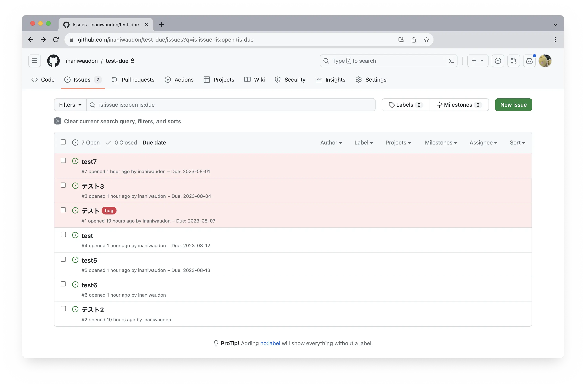

# github-issues-due

Chrome Extension to specify a due date for a GitHub Issue.



## Abstract

GitHub's Issues feature is very useful as a task management tool. On the other hand, setting a due date for each issue requires relating to milestones, which can be a bit complicated operation.

This extension implements the specification of a due date to an issue easily by writing `due: 2023-08-07` in the body of the issue.

## How to use

1. Get a personal access token from [Developper Settings](https://github.com/settings/apps). It requires permission to read issues for all repositories.

2. write environments to `.env`.

    ```
    VITE_GITHUB_TOKEN=github_pat_***
    VITE_DANGER_DAYS=1
    ```

3. Execute the following commands. The built files will be generated under `/dist`.

    ```
    yarn
    yarn run build
    ```

4. Read a unpackaged extension from [chrome://extensions/](chrome://extensions/) and select the `/dist` directory.

5. When opening an issue, specify a due date in the body of the issue using the following notation.

    ```
    due: yyyy-mm-dd
    due: yyyy-m-d
    due: yyyy/mm/dd
    due: yyyy/m/d
    ```

6. The description of `Due: yyyy-mm-dd` will appear in the list of open issues. By clicking on the link of [Due Date], the issues are sorted by the order of their due dates.

## Liscense

(c) 2023 inaniwaudon. This software is released under the MIT Liscense.
